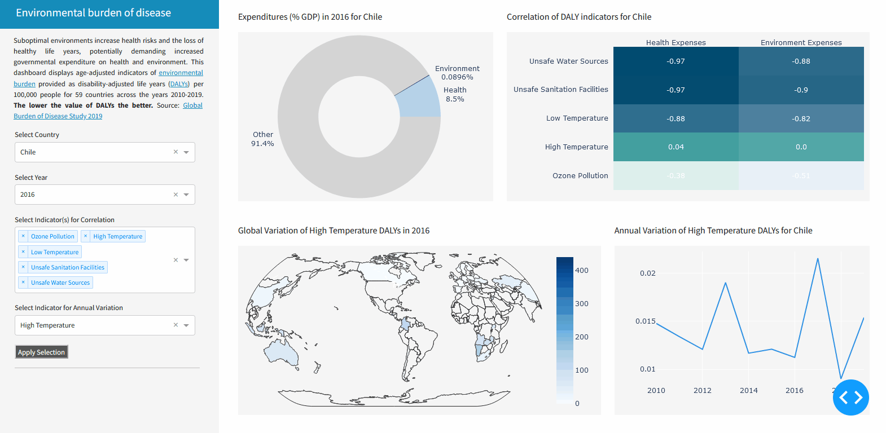

# Environmental Burden of Disease Dashboard

## The underlying concept
The environmental burden of disease refers to the impact that environmental factors, such as pollution or climate change might have on human health. These factors can contribute to loss of life years and declining health, leading to morbidity and mortality. Impact on human health can be measured as DALYs, i.e. disability-adjusted life years.

## About this project
This repository contains a dashboard that visualizes DALY indicators related to the environmental burden of disease for the years 2010-2019. Through interactive visualizations, users can explore trends and patterns per country. Feel free to explore the dashboard but keep in mind that this project has just started and more indicators, features, countries, years, etc. will be added in the future.

## Get started
The only manual step required is that you have to download the data and run the EDA.pynb file after cloning the repository.

